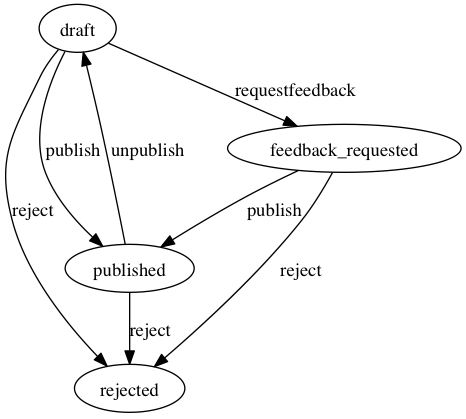

StateMachineExporter
====================

The StateMachineExporter is a simple tool to quickly generate a Graphviz
compatible file (`.dot` file) from a Propel XML schema, and the
[StateMachineBehavior](https://github.com/willdurand/StateMachineBehavior).

This tool is provided as a `phar`, run the following command to generate a
`.dot` file:

    php statemachine-exporter.phar [filename]

It will generate a file containing, for example, the following data:

    digraph G {
        draft -> published [label="publish"]
        draft -> feedback_requested [label="requestfeedback"]
        draft -> rejected [label="reject"]
        published -> draft [label="unpublish"]
        published -> rejected [label="reject"]
        feedback_requested -> published [label="publish"]
        feedback_requested -> rejected [label="reject"]
    }

You can use [dot](http://www.graphviz.org/doc/info/command.html) to generate a
PNG:

    dot -Tpng generated_file.dot > generated_file.png

Here is an example:

License
-------

StateMachineExporter is released under the MIT License. See the bundled LICENSE
file for details.
